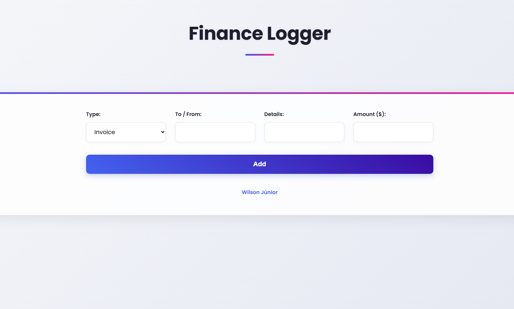

# 📒 Finance Logger

Este é um pequeno projeto em **TypeScript + HTML/CSS** que registra **Invoices** e **Payments**, criado como exercício prático de manipulação de tipos com TypeScript, DOM e organização de classes.



---

## Tecnologias

- HTML5
- CSS3
- TypeScript
- Web Modules (via `<script type="module">`)

---

## Como Rodar

1. Clone o repositório:

```bash
git clone https://github.com/seu-usuario/finance-logger.git
cd finance-logger
```

2. Instale as dependências (caso haja):

```bash
npm install
```

3. Compile o TypeScript para JavaScript:

```bash
npx tsc
```

4. Abra o `index.html` no navegador.

---

## Estrutura

```
.
├── index.html
├── styles.css
├── app.ts
├── app.js       # gerado pelo TypeScript
├── tsconfig.json
└── README.md
```

---

## Aprendizados

- Classes e Interfaces em TypeScript
- Organização de código com orientação a objetos
- Manipulação de formulários e eventos com segurança de tipos

---

## Autor

Feito com 💜 por [Wilson Júnior](https://www.linkedin.com/in/wilson-j%C3%BAnior-6956052a8/)  


---

## Créditos

Projeto inspirado no curso do canal [The Net Ninja](https://www.thenetninja.co.uk)
